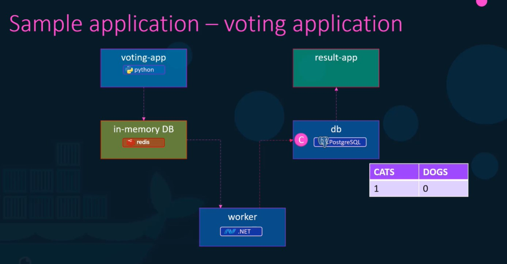
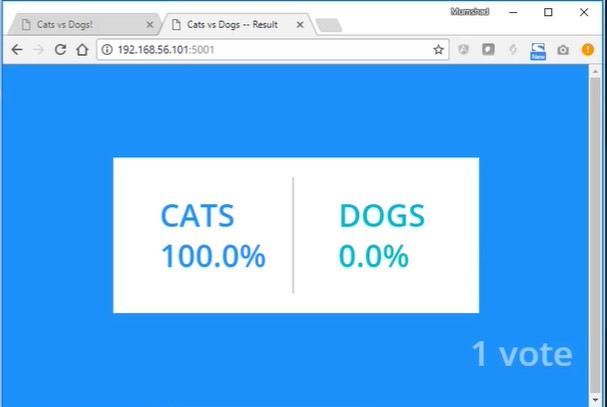
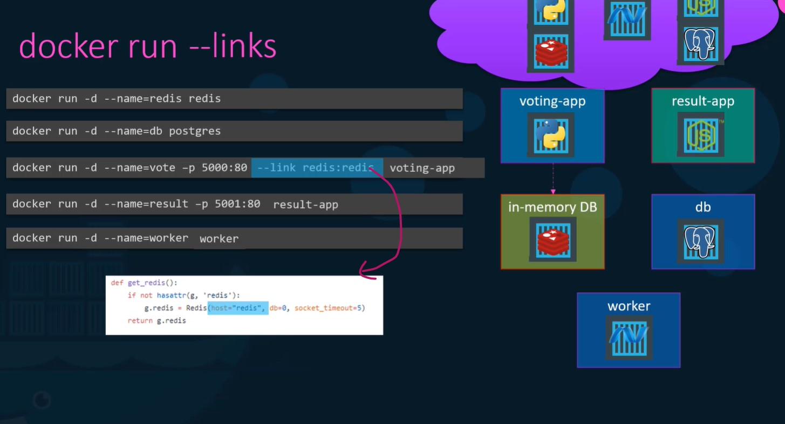
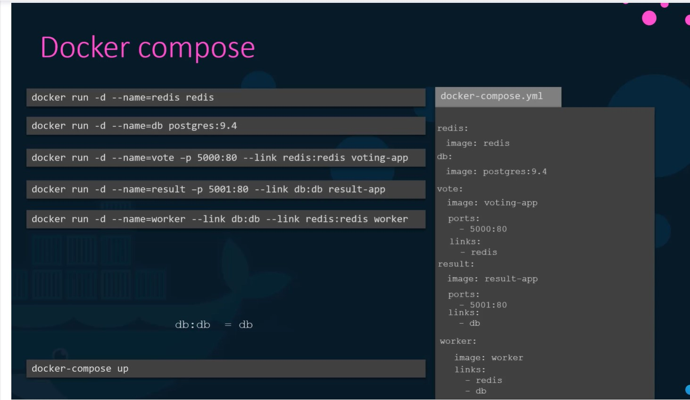
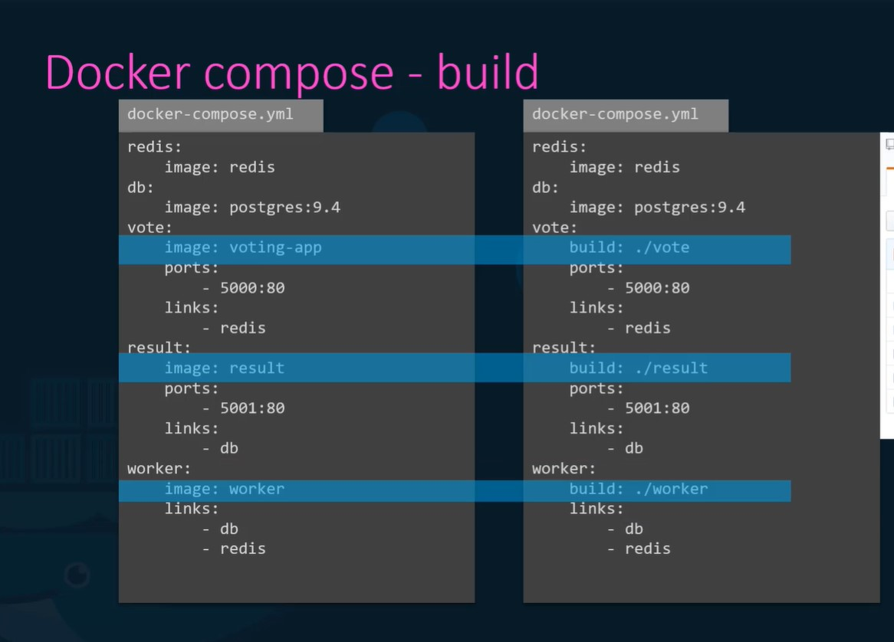
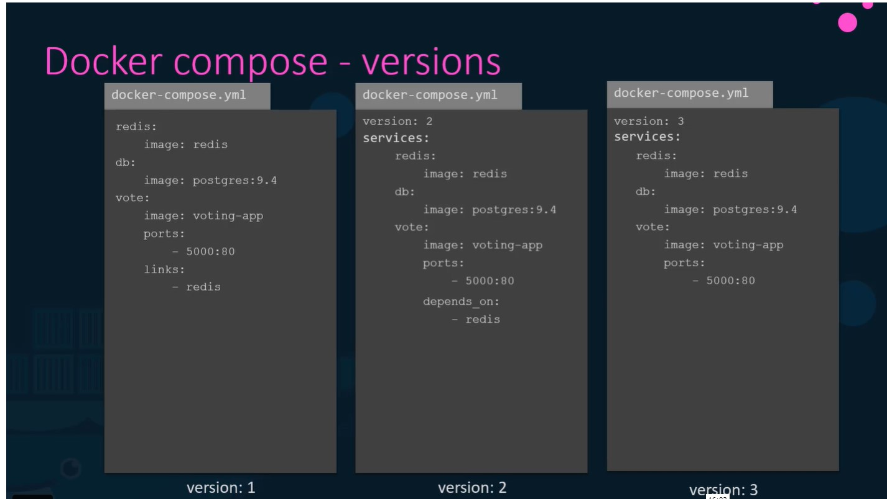
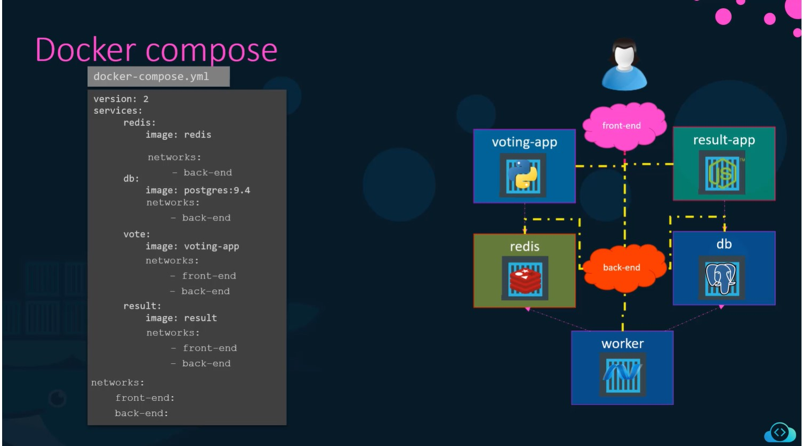

# Docker Compose

Nomrally a realtime application may be combination of technologies and various environments,
so we will be having the various environments as different images then we would build and run
the images and make the environments communicable in the code running in the container.  

So consider a web-app which having mongodb database and redis cache and configured in ansible
then we will have to run as below,

> docker run myapp

> docker run mongodb

> docker run redis:alpine

> docker run ansible

So it will be difficult to manage the images when the environments and technologies are increased,
 to avoid  this issues we can use docker compose, where we would configure all the images in a yaml file named docker-compose.yml as below,

 ```yaml

docker-compose.yml

services:
    web:
        image: "ganku007/myapp"
    database:
        image: "mongodb"
    messaging:
        image: "redis:alpine"
    configuration:
        image: "ansible"

 ```

## Sample application

Architecture:



Output of the application:



**We have to name all the container while running the image since we have to link the dependent
container**

```bash

docker run -d --name=redis redis
docker run -d --name db postgres
docker run -d --name=vote -p 5000:80 --link redis:redis voting-app  ## link is used to link the dependent container to this container by name (thats why we have named alla the container).  Here the vote app is dependent (the redis container is used inside the vote app.  The below image explain this)
docker run -d --name=result -p 5001:80 --link db:db result-app
docker run -d --name=worker -p worker --link db:db --link redis:redis worker

```



The above commands can be configured in compose file and can be manage easily,

docker-compose.yml

```yaml

redis:
    image: redis
db:
    image: postgres:9.4
vote:
    image: voting-app
    ports:
        - 5000:80
    links:
        - redis  # in the link we can also spefify redis:redis, since both are same name we have mention only redis. if the targer and source are different then we have to mention both the names.
result:
    image: result-app
    ports:
        - 5001:80
    links:
        - db
    
worker:
    image: worker
    links:
        - redis
        - db
```



## How images get build



In the above images redis and db (postgresSql) are predefined images but all the other apps
(votes, result and worker) are custom images so as specified in the above images instead of
giving the image name we can map the folder (which contains code and dockerFile) to buid.
In this case (build), while building the compose file it create a temp image name for those
custom built images and used as required.

## Docker Compose - versions:



## Networks:


