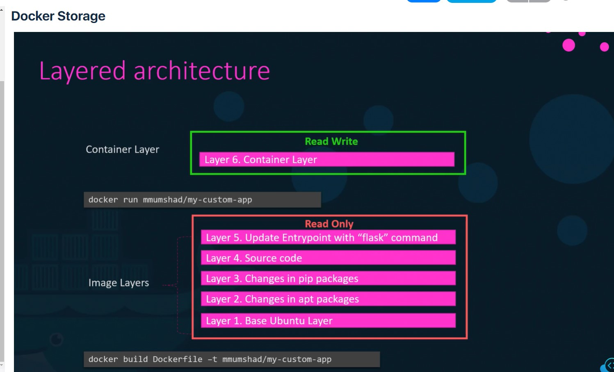
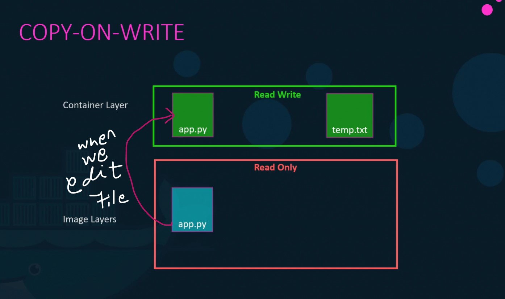
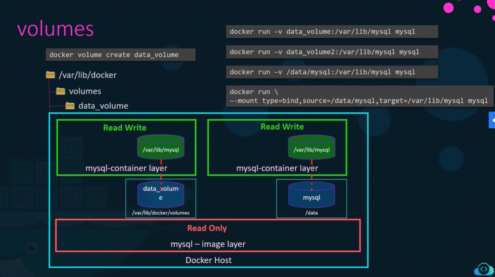

# Docker Storage

## File System

Docker stores its files in /var/lib/docker path.

## Layered Architecture

## Volumes

Volumes are used to maintain persistence data by saving the data in host and map the data to the container.

> docker volume create data_volume

it create a folder data_volume under volumes folder in /var/lib/docker

> docker run -v data_volume:/var/lib/mysql mysql

## Storage drivers

* AUFS
* ZFS
* BTRFS
* Device Mapper
* Overlay
* Overlay2

