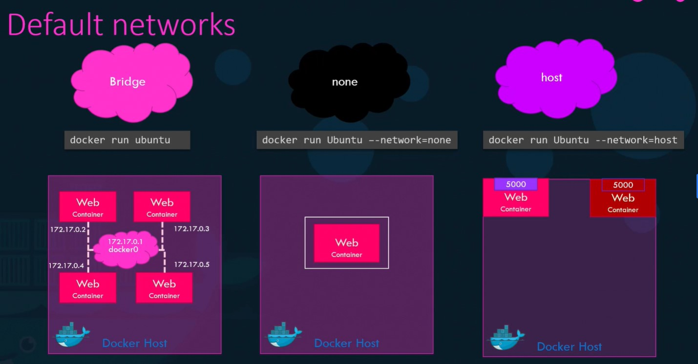
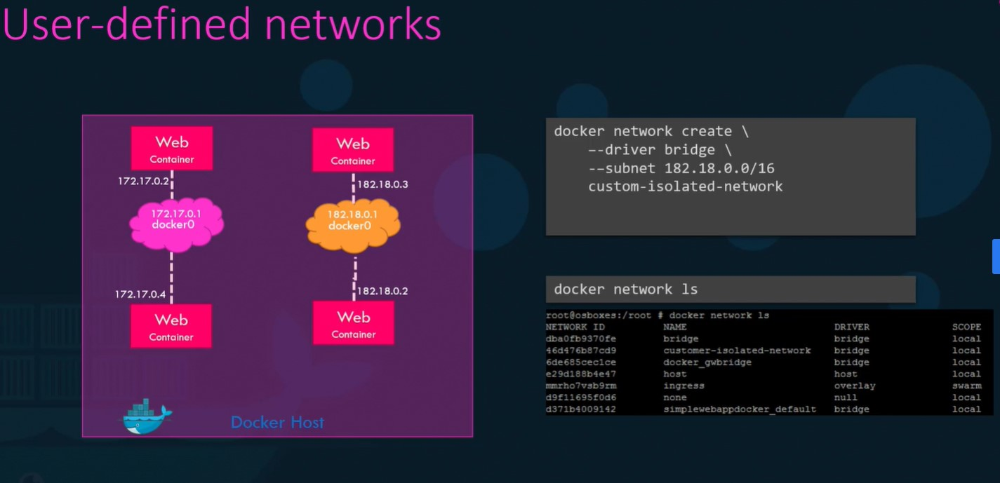
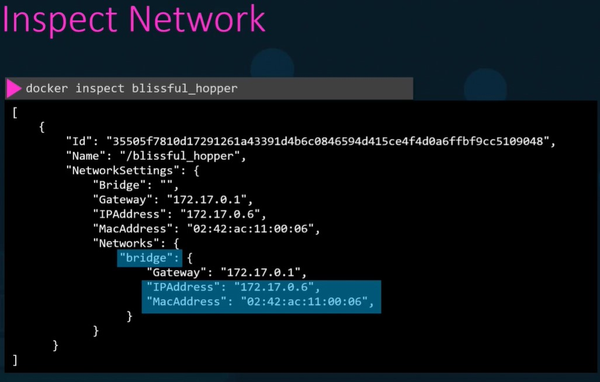
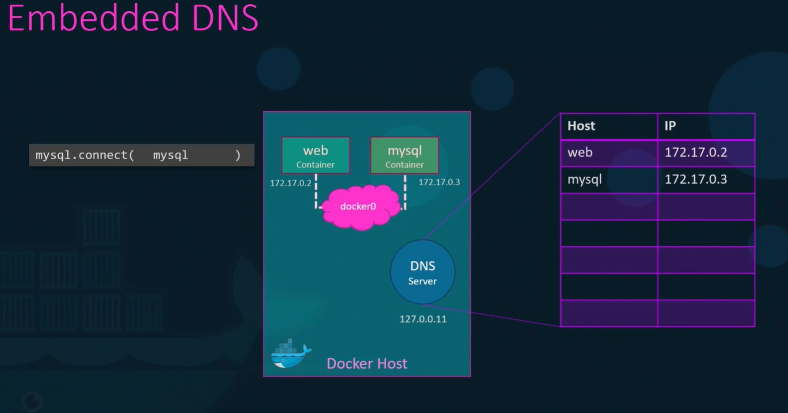

# Docker Networking

When we install docker it creates 3 networks automatically,

* Bridge (default network)
* None
* Host

Bridge is the default network, if we want to specify other network we have to run as,

docker run Ubuntu --network=none



## User-defined networks

 > docker network create --driver bridge --subnet 182.18.0.1/24 --gateway 182.18.0.1 wp-mysql-network  



## Inspect Network

> docker inspect network-name



## Embedded DNS:

container reach other container by its name!

Container could not reach other containers by its ip address since the ip addressess change when it rerun or crashed, etc.  

Docker creates separate namespace for each container by built in DNS server.



The technology behind it is **Virtual Ethernet pairs**

## Practice

```bash
docker run --name mysql-db --network wp-mysql-network -d -e MYSQL_ROOT_PASSWORD=db_pass123 mysql:5.6
```
