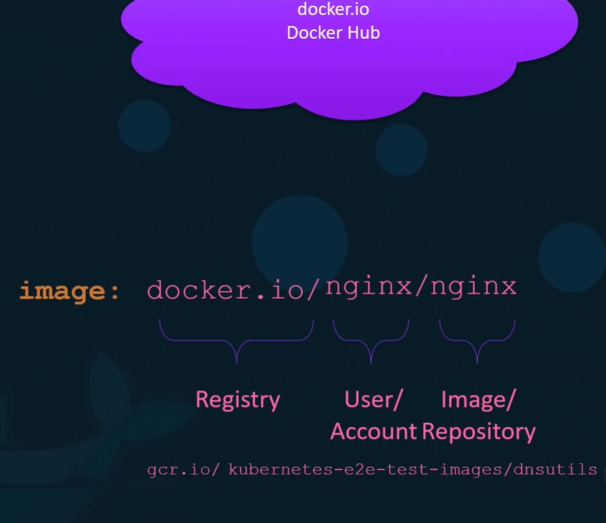
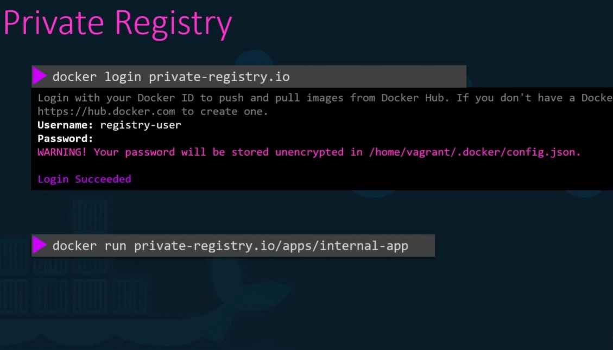

# Docker Registry

It is the central repository for the docker images.

When we run `docker run ninix`,

it will search registry-name(docker.io)/nginx/nginx (user or account/Image or repository).
here it means nginx is getting downloaded from the user or account ngnix.  If we didn't
mention user account then it assumes the account name and the image name is
same (as in the above example.)  If Registry is not mentioned then it would search in
docker's default registry docker.io.

When we edit and push the images it would pushed to the registry.

## Private Registry

If any images we are creating is not supposed to be available in public then we can keep the images in private registry.

Many cloud providers provide this facility (AWS,AZURE,GCP)

## Practice
docker run --name my-registry -p 5000:5000 --restart=always registry:2

Now its time to push some images to our registry server. Let's push two images for now .i.e. nginx:latest and httpd:latest.

Note: Don't forget to pull them first.

To check the list of images pushed , use curl -X GET localhost:5000/v2/_catalog

Run: docker pull nginx:latest then docker image tag nginx:latest localhost:5000/nginx:latest and finally push it using docker push localhost:5000/nginx:latest.
We will use the same steps for the second image docker pull httpd:latest and then docker image tag httpd:latest localhost:5000/httpd:latest and finally push it using docker push localhost:5000/httpd:latest

Let's remove all the dangling images we have locally. Use docker image prune -a to remove them. How many images do we have now?

Note: Make sure we don't have any running containers except our registry-sever.
To get list of images use: docker image ls

Now we can pull images from our registry-server as well. Use docker pull [server-addr/image-name] to pull the images that we pushed earlier.

In our case we can use: docker pull localhost:5000/nginx

docker stop my-registry and then docker rm my-registry