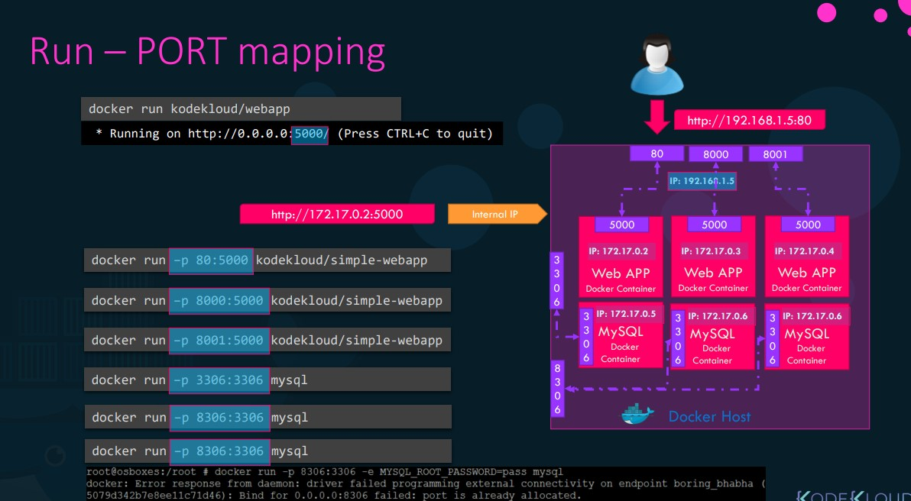

# Docker Run

```docker
> docker run redis # will run the redis container and the version will be the latest (tag latest).

> docker run redis:4.0 # will run the redis container of version 4.0 here 4.0 is TAG

> docker run -i containername  # it will run container interactive mode means if it is not interactive mode, it wont listen to any stdin and you could not provide input(or interactive) to the container start if any prompt written.

> docker run -it containername # in the above command, eventhough it is an interactive mode since it is not attached, it wont accept any prompt as well. we have  to interactive and attached to be communicated with the container.
```

## Run - port mapping



Consider an application ganku007/webapp, this application is running on a port 5000,

```docker
> docker run ganku007/webapp

# Running on http://0.0.0.0:5000/  This is the output of the above command means it is running on port 5000.  So if we want to communicate with the app we have to do it via port 5000 via the container's IP address (this address is only accessible in docker host and not out  side of the host.) or we have to map the port 5000 (container port) ot one of the host's **free** ports so the outside world of docker host can access the container via docker host's port. We can run any number instances of the app via different docker host's ports but one port can be mapped to on instance.  

Below are the example,

> docker run -p 80:5000 ganku007/webapp

> docker run -p 8000:5000 ganku007/webapp

> docker run -p 8001:5000 ganku007/webapp

> docker run -p 3306:3306 mysql

> docker run -p 8306:3306 mysql
```

## Run - Volume mapping

Lets consider mysql container, while running it, when databases and tables are created, the data files are stored in location /var/lib/mysql insde the docker container and remember, the docker container has it's own isolated file system. AS soon as you delete the container all the data available within the container also get deleted. 

If you want to persist the data then you have to map the data out side container on the docker host.  So consider I have a folder created **/opt/datadir** and we can map the data as below using volume tag (-v). By this way all the data will be stored in docker host not in the container so when the container is get deleted the data will be persisted in docker host and will not get deleted.  Tagging images is for purpose of creating images for different purposes.

```docker
> docker run -v /opt/datadir:/var/lib/mysql mysql

> docker inspect container_name # it will other details of docker containers it will have details which is not listed in **docker ps** command

> docker logs container_id_or_name # used to view logs on the running containers.
```
