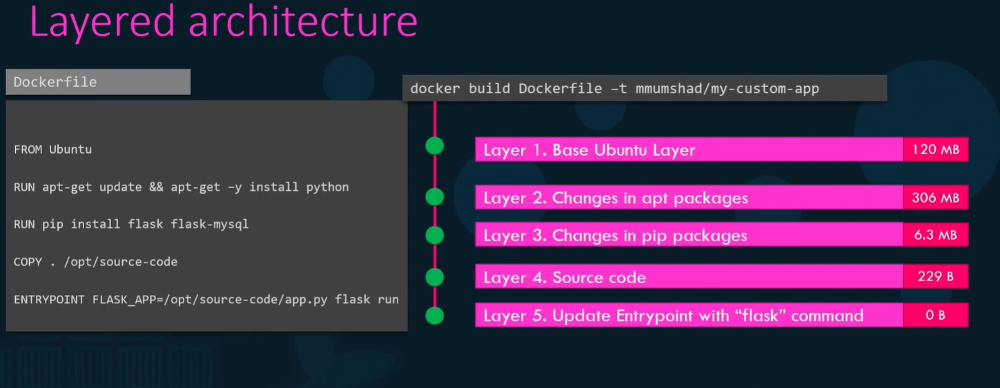
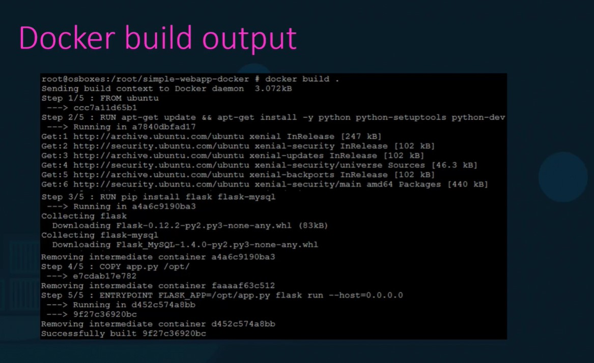

# Docker - Images

## Why we have to create a new image


## How to create a new Image

While creating an image we have to clearly have an idea on how we are going to deploy the application. for example for deploying an flask application,

* OS - Ubuntu
* Update apt repo
* Install dependencies using apt
* Install Python dependencies using pip
* Copy source code to /opt folder
* Run the web server using "flask" command

We have to create a dockerfile based on the above steps,  In docker file everthing is in Instruction - Argument format,  all the Instructions are in caps  and the instructions may be some commands as below,

(FROM, RUN, COPY, ENTRYPOINT are example of INSTRUCTIONs),

```bash
Dockerfile

FROM Ubuntu
RUN apt-get update
RUN apt-get install python

RUN pip install flask
RUN pip install flask-mysql

COPY . /opt/source-code

ENTRYPOINT FLASK_APP=/opt/source-code/app.py flask run

```

Then,

Build the docker file,

> docker build Dockerfile -t ganku007/myflask-app

this will create the image locally and we can make it available in public by pushing the image in public docker hub registry by specifying a name.

> docker push ganku007/myflask-app

## What is in docker file:

* it should start from FROM instruction (means image should start from base OS mentioned or other image)
* RUN instructions are to install all the dependencies
* COPY instruction is to copy the source code to docker container from the host
* ENTRYPOINT instruction is to a command to run while running the container.  A docker file can have only one ENTRYPOINT instruction.

## Layered architecture

* Docker build image in Layered architecture.
* first layer is the base os layer
* likewise each instruction are layers while build.
* Each layer only stores the changes from the previous layer it is reflected in the size as well in each layer





* When docker build in a paticular layer then you have to fix the error and rebuild the image again then the build will not start from scratch it will get the details from the previous successful layer from cache and continue from the failed layer.
* We can containerize almost all the application.

## Practice

<https://github.com/mmumshad/simple-webapp-flask>


```bash

> docker run -it ubuntu bash
root@df916d066872:/> apt-get install -y python
root@df916d066872:/> apt-get python
root@df916d066872:/> apt-get install -y python
root@df916d066872:/> pip install flask
root@df916d066872:/> apt-get install python-pip
root@df916d066872:/> pip install flask
root@df916d066872:/> cat > /opt/app.py
root@df916d066872:/>  # paste the flask code in the file uing vi command in the app.py
root@df916d066872:/> cd opt
root@df916d066872:/opt> FLASK_APP=app.py flask run --host=0.0.0.0
* Serving Flask app "app"
* Running on http://0.0.0.0:5000/ (Press CTRL+C to quit)

```
