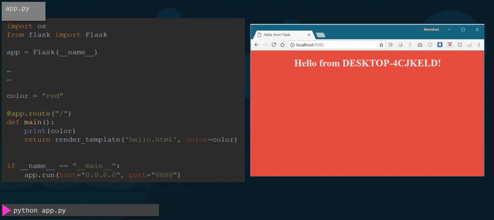
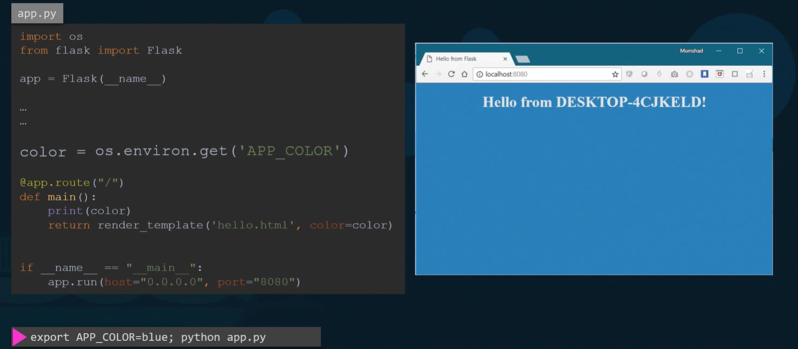
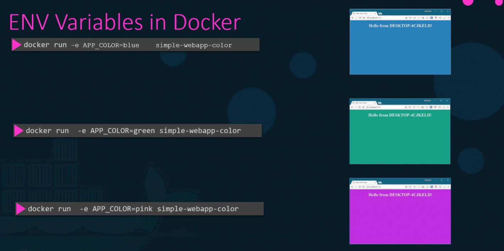
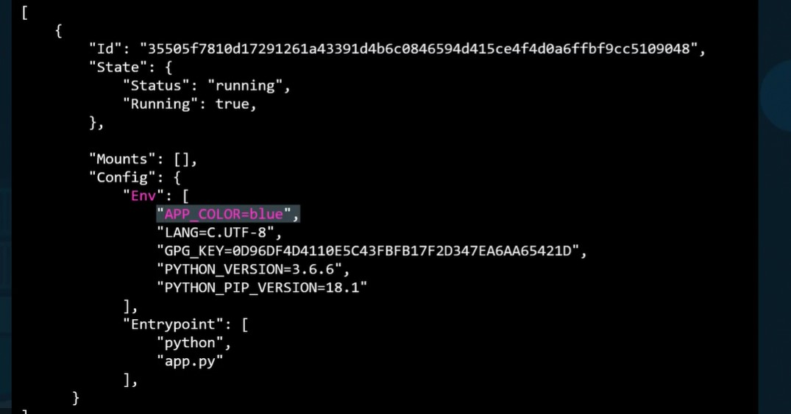

# Environment variables

In the above code color is hard coded and we are going to make it run by environment variables.  

So we have modified the code as below and run the python code after setting up the environment variable with blue.

When we packed the app as docker image simple-webapp-color while running the docker image we have to pass the environment variables with this as below.

We can check what are environment variables using inspect command

> docker inspect simple-webapp-color

While running the above command we can check the environment variables in env block as below,

